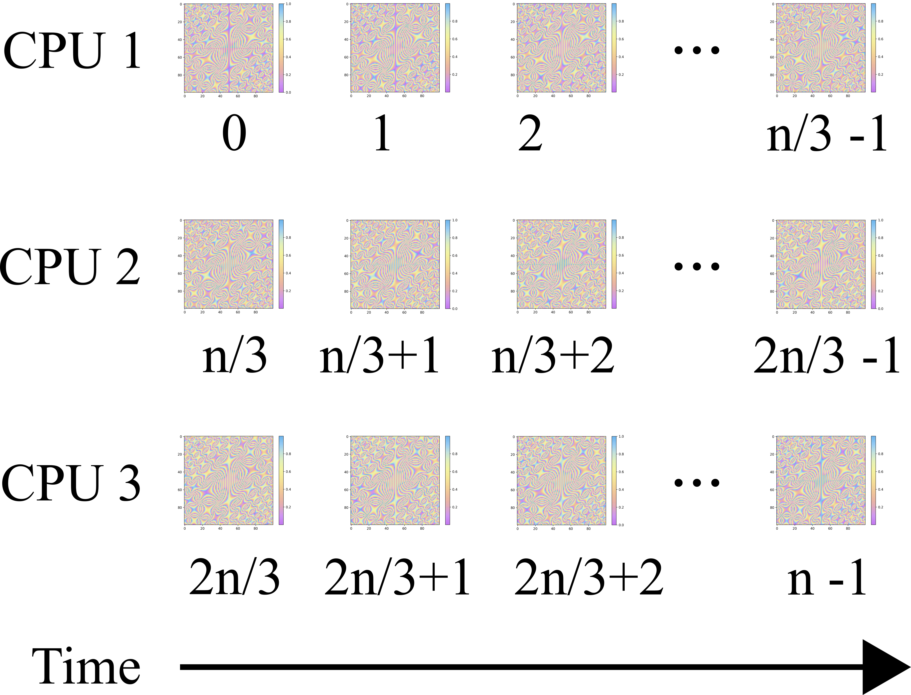
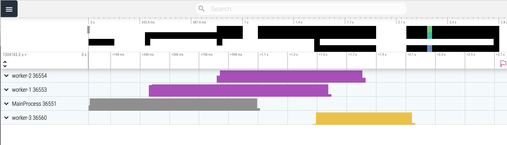
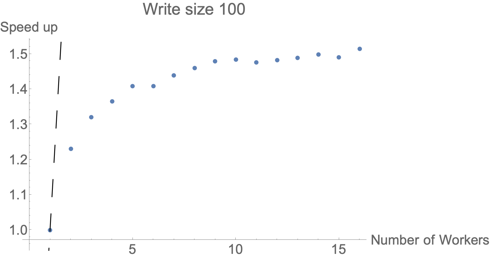
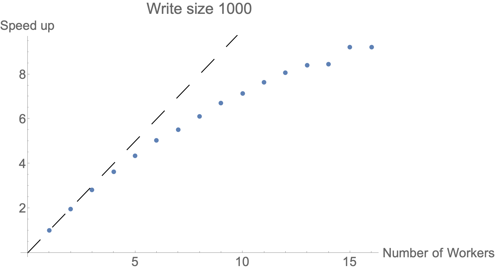
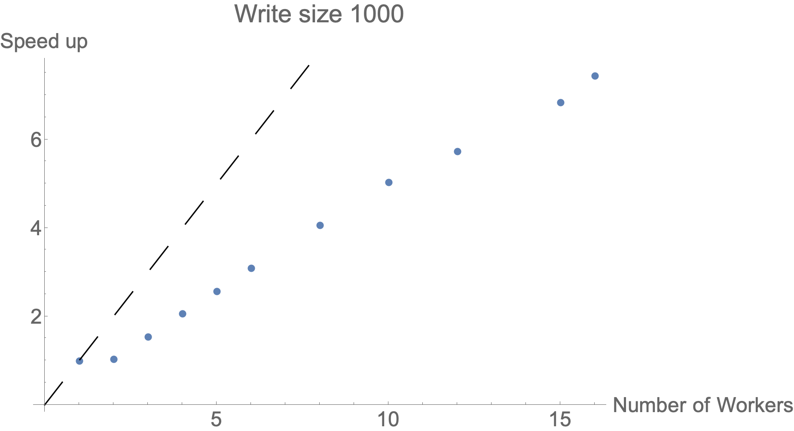
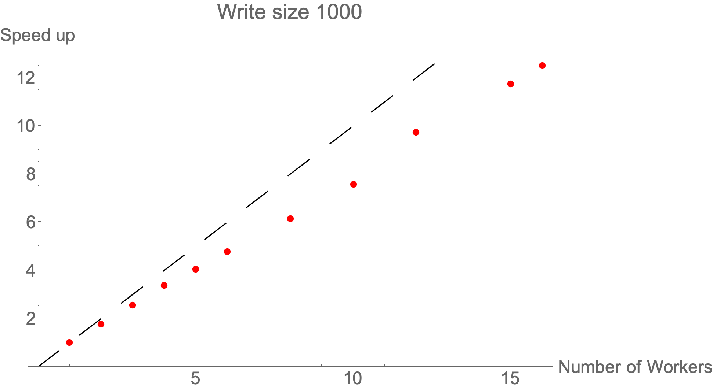
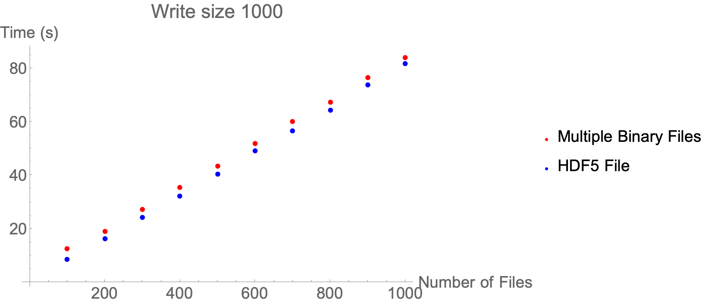
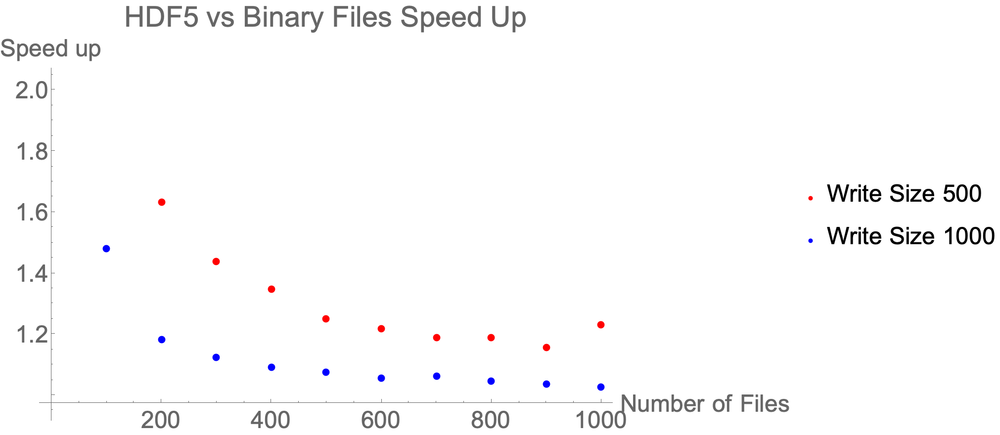
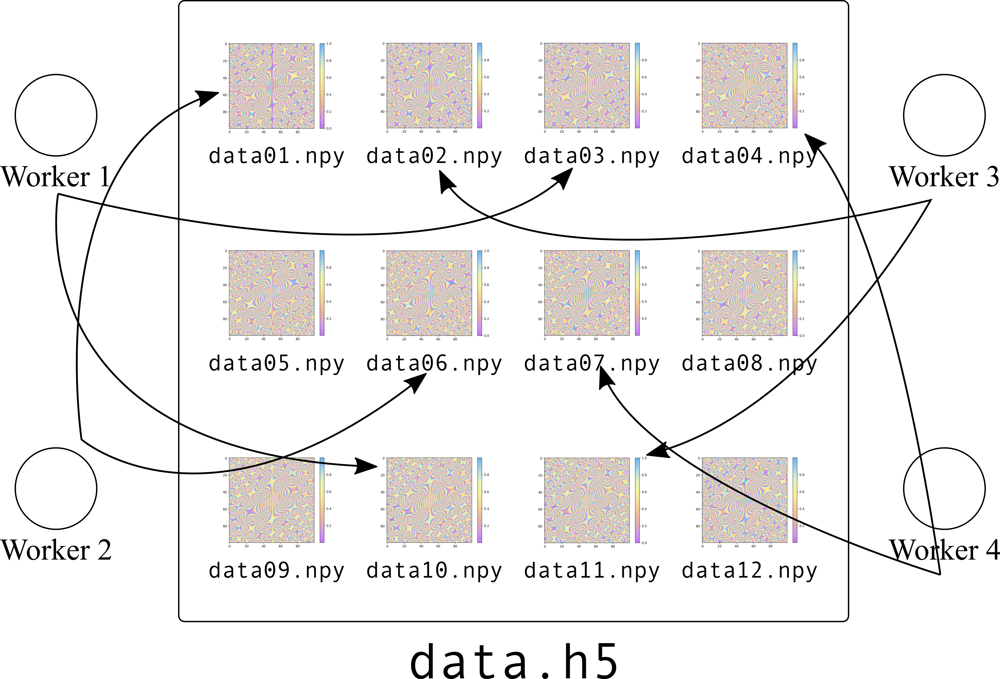
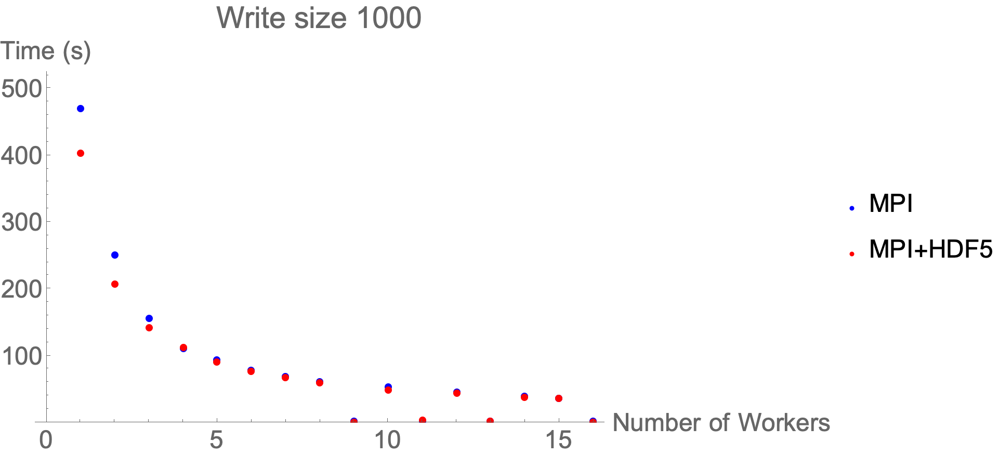

```{r setup, include = FALSE}
knitr::opts_chunk$set(echo = TRUE)
knitr::knit_engines$set(python=reticulate::eng_python)
```


## Outline

- Setup
- How to profile code
    -   Look for "slow" sections
- Making improvements
- Single node parallel
    - Multiple cpus, 1 computer
- Multi node parallel
    - Multiple cpus, multiple computers

## Installing Dependencies
Get presentation materials
```{r,engine='bash',eval=FALSE}
git clone https://github.com/uschpc/workshop-hpc-python.git
```
- Easiest to do from conda environment
- From Discovery/Endeavour cluster initialize conda with

```{r,engine='bash',eval=FALSE}
module purge
module load conda
eval "$(conda shell.bash hook)"
```

- Initialize environment
```{r,engine='bash',eval=FALSE}
conda env create -f environment.yml
```


## Profiling & Benchmarking


1. Profile code to understand the execution time and memory use of each part
2. Identify bottlenecks (i.e., parts of code that take the most time)
3. Try to improve performance of bottlenecks by modifying code
4. Benchmark alternative code to identify best alternative

### Eventually you need to stop

- Aim for *fast enough* code  
- Compute time is less expensive than human time


##  Example
<div class="columns-2">
```{r,echo=FALSE,out.width="100%"}
knitr::include_graphics("images/example_viz.png")
```

- `examples/write.py`
- Generate some data, write to .txt file
- Let's measure performance for baseline
- `python -m cProfile -s tottime write.py -n 100`
    - Generates text output, might need tools to parse
- `python -m cProfile -o write.log examples/write.py -n 100`
    - Write 100 files
    - Generates binary file, need utility to view
    - `snakeviz write.log`

</div>


## Interpreting results

<div class="columns-2">
```{r,echo=FALSE,out.width="100%"}

```

- Visualize which parts took the longest
- Summary table below
- `generate_data` called 1000000 times
    - consumed ~2.9s of runtime
- `npyio.py` called 100 times
    - consumed ~0.75s of runtime
</div>


## Interpreting results

This snippet is not great
```{r,engine='python',eval=FALSE,highlight=TRUE}
def write_data(x,y,n,t):
    filename=("output/%s%05d" %(output,i))

    i_max=len(x)
    j_max=len(y)
    data=np.zeros((i_max,j_max))

    for i in range(i_max):
        for j in range(j_max):
            data[i,j]=generate_data(x[i],y[j],nFiles,fileID)

    np.savetxt(filename,data)
```

where `generate_data()` is defined as:

```{r,engine='python',eval=FALSE,highlight=TRUE}
def generate_data(x,y,n,t):
    value = (x/10)**2*(y/10) + (y/10)**2*(x/10)+t/n
    value = value %1 # Keep number between 0 and 1
    return value
```

- `n` - number files to be generated
- `t` - which file to generate


## Vectorizing code

- Loops in Python tend to be slow
- Apply same operation to each element
- Packages like numpy often have built-in vectorized versions
- Often written in C/C++/Fortran for performance
- Use built in functions when possible

`numpy.meshgrid(*xi, copy=True, sparse=False, indexing='xy')`

>  Return coordinate matrices from coordinate vectors.
> Make N-D coordinate arrays for vectorized evaluations of N-D scalar/vector fields over N-D grids, given one-dimensional coordinate arrays x1, x2,…, xn.

## Vectorizing code

```{r,engine='python',eval=FALSE,highlight=TRUE}
def write_data(X,Y,n,t):
    filename=("output/%s%05d" %(output,i))

    Z = generate_data(X,Y,nFiles,i)
    np.savetxt(filename,Z)

```
Where
```{r,engine='python',eval=FALSE,highlight=TRUE}
x = np.arange(x_origin-size/2,x_origin+size/2,1)
y = np.arange(y_origin-size/2,y_origin+size/2,1)
X,Y = np.meshgrid(x,y)
```
- See example under `examples/write_vectorized.py`

## Check performance

`python3 -m cProfile -s tottime examples/write_vectorized.py -n 100 write_vectorized > write_vectorized`

|ncalls|tottime|percall|cumtime|percall|filename:lineno(function)|
|---|---|---|---|---|---|
|  100|0.870|0.009|1.145|0.011|npyio.py:1191(savetxt)|
|  200|0.160|0.001|0.162|0.001|{built-in method io.open}|
|  115|0.075|0.001|0.075|0.001|{built-in method io.open_code}|
|34/32|0.054|0.002|0.058|0.002|{built-in method _imp.create_dynamic}|
|10000|0.051|0.000|0.051|0.000|{method 'write' of '_io.TextIOWrapper' objects}|
|  100|0.044|0.000|0.044|0.000|write_vectorized.py:6(generate_data)|

## Check performance

Original `write.py` ~4.8s

|ncalls|tottime|percall|cumtime|percall|filename:lineno(function)|
|---|---|---|---|---|---|
|1000000|2.854|0.000|2.854|0.000|write.py:6(generate_data)|
|100|0.749|0.007|1.011|0.010|npyio.py:1191(savetxt)|
|100|0.673|0.007|4.540|0.045|write.py:11(write_data)

New `write_vectorized.py` ~ 1.4s

|ncalls|tottime|percall|cumtime|percall|filename:lineno(function)|
|---|---|---|---|---|---|
|100|0.870|0.009|1.145|0.011|npyio.py:1191(savetxt)|
|100|0.044|0.000|0.044|0.000|write_vectorized.py:6(generate_data)|
|100|0.001|0.000|1.191|0.012|write_vectorized.py:11(write_data)|


## Read/write performance

- Our example has the line

```{r,engine='python',eval=FALSE,highlight=TRUE}
    np.savetxt(filename,data)
```
- Generate many small files in plain, text
- Sacrifice readibility for performance?
```{r,engine='python',eval=FALSE,highlight=TRUE}
    np.save(filename,data)
```
- We save time by writing less data, in binary
- [numpy.savetxt](https://numpy.org/doc/stable/reference/generated/numpy.savetxt.html)
- [numpy.save](https://numpy.org/doc/stable/reference/generated/numpy.save.html)

## Check performance

`write_vectorized.py` ~1.4s

|ncalls|tottime|percall|cumtime|percall|filename:lineno(function)|
|---|---|---|---|---|---|
|100|0.870|0.009|1.145|0.011|npyio.py:1191(savetxt)|
|100|0.044|0.000|0.044|0.000|write_vectorized.py:6(generate_data)|
|100|0.001|0.000|1.191|0.012|write_vectorized.py:11(write_data)|

`examples/write_vectorized_binary.py` ~0.46s

|ncalls|tottime|percall|cumtime|percall|filename:lineno(function)|
|---|---|---|---|---|---|
|100|0.174|0.002|0.174|0.002|{built-in method io.open}|
|100|0.044|0.000|0.044|0.000|write_vectorized_binary.py:6(generate_data)|
|100|0.001|0.000|0.220|0.002|write_vectorized_binary.py:11(write_data)|
|100|0.002|0.000|0.265|0.003|npyio.py:457(save)|

## Check performance
- Performance is pretty good BUT
- ~40% of time is WAITING on opening files
- Keep in mind for later
- Assume we have fine tuned program
- Assume it's worth our time to make it faster
- What next?

## Parallel programming

- Generally parallel means concurrent execution of tasks
- Depends on the needs of your program
- Doing other tasks while waiting for IO to finish
- Splitting up workload across "workers" (cpus/compute nodes)


## Parallelization drawback

- Some computations are not worth parallelizing
- Some costs to parallelizing (overhead):
  - changing code
  - spawning child processes
  - communications
- Speedup not proportional to number of cores (Amdahl's law)
- Optimal number of cores
  - depends on specific computations
  - experiment to find
- Different issues pop up as you scale


## Parallelizing our example

- Currently script writes data files in sequence
- It may be possible to write multiple files at the same time

```{r,echo=FALSE,out.width="100%"}
knitr::include_graphics("images/serial_write.svg")
```

## Parallelizing our example
<div class="columns-2">

```{r,echo=FALSE,out.width="100%"}

```

- If we could write 3 files at once, we should see speedup
- Our files can be written out of sequence
- We must somehow evenly distribute work

</div>
## Python multiprocessing
- [Multiprocessing](https://docs.python.org/3/library/multiprocessing.html) is a built-in package
- Create pool of processes
- Typical example, apply a function over multiple inputs
```{r,engine='python',eval=FALSE,highlight=TRUE}
def f(x):
    return x*x

if __name__ == '__main__':
    with Pool(5) as p:
        print(p.map(f, [1, 2, 3]))
```

- Since we have multiple arguments
```{r,engine='python',eval=FALSE,highlight=TRUE}
with mp.Pool(processes=nWorkers) as pool:
    for i in range(0,nFiles):
        pool.apply(write_data,args=(X,Y,output,nFiles,i,))
```
- Also add `-w` option for `nWorkers`
- See example under `examples/write_multiprocessing.py`

## Hardware configuration

- Compute nodes have different configurations
  - number of cores
  - amount of memory
- On CARC systems:
  - [Discovery Resource Overview](https://www.carc.usc.edu/user-information/user-guides/hpc-basics/discovery-resources)
  - Enter `sinfo2` in shell to see node types
  - 1 logical CPU = 1 core = 1 thread (`--cpus-per-task`)

## Example Slurm job script for multiple cores

```{r,engine='bash',eval=FALSE,highlight=TRUE}
#!/bin/bash

#SBATCH --nodes=1
#SBATCH --ntasks=1
#SBATCH --cpus-per-task=8
#SBATCH --mem=16GB
#SBATCH --time=1:00:00
#SBATCH --account=<account_id>

module purge
module load conda
eval "$(conda shell.bash hook)"
conda activate hpc-python

python3 /path/to/script.py

```
- We can launch our script with something like  `python3 write_multiprocessing.py -w 3 -n 100`
- Check example job script
  - `examples/job-scripts/multicore.job`


## Viztracer Profiling
- Let's use [Viztracer](https://viztracer.readthedocs.io/en/latest/index.html) to profile
- `viztracer  -o multiprocessing.json  examples/write_multiprocessing.py -w 3 -n 100`
- `vizviewer  multiprocessig.json`
- use 'wasd' to navigate

```{r,echo=FALSE,out.width="75%"}

```


## Viztracer Profiling (1K files)
- For 1 worker, ~6.7 s

|ncalls|tottime|tottime/3|function|
|---|---|---|---|
|1000|3.1|1.6|io.open|
|1001|0.9|0.3|**recv_bytes**|
|1000|0.48|0.16|generate_data|

- For 3 workers, ~7.6 s

|ncalls|tottime|tottime (per worker)|function|
|---|---|---|---|
|2003|8.2|2.7|**__enter__**|
|1000|3.6|1.9|io.open|
|1003|7.2|2.5|**recv_bytes**|
|1000|0.6|.2|generate_data|

## Communication Overhead
- Despite more workers, no speedup
- There is communication overhead
- This line is problematic:

```{r,engine='python',eval=FALSE,highlight=TRUE}
pool.apply(write_data,args=(X,Y,output,nFiles,i))
```

- During communication, variables are "pickled" or serialized
- We pass in `X,Y,output,nFiles` even though they never change


```{r,echo=FALSE,out.width="100%"}

```

## Multiprocessing Queues
<div class="columns-2">
```{r,echo=FALSE,out.width="100%"}
knitr::include_graphics("images/mpq_diagram.png")
```

- Use queues and custom process class - Each worker process initilized with data
- Main process adds data to queue
- Worker process get data from queue and does work
</div>

## Custom process class
You can find this in `examples/write_multiprocessing_queue.py`
<div class="columns-2">
```{r,engine='python',eval=FALSE,highlight=TRUE}
class worker(mp.Process):
    ## Initialize static proccess data
    def __init__(self,task_queue,size,
    output,nFiles,**kwargs):
        super(worker,self).__init__()
        x_origin=0
        y_origin=500
        x = np.arange(x_origin-size/2,x_origin+size/2,1)
        y = np.arange(y_origin-size/2,y_origin+size/2,1)

        self.X,self.Y = np.meshgrid(x,y)
        self.nFiles=nFiles
        self.output=output
        # Where to get work from
        self.task_queue=task_queue


    # Define work each process does
    def run(self):
    print("Starting Process:%d " % self.pid)
    time.sleep(1)
    while True:
        try:
            i = self.task_queue.get(timeout=1)
        except q.Empty:
            print("No more work to do")
            #self.terminate()
            break

        write_data(self.X,self.Y,self.output,self.nFiles,i)
        self.task_queue.task_done()
    return
```
</div>

## Populate the Queue
You can find this in `examples/write_multiprocessing_queue.py`
<div class="columns-2">
```{r,engine='python',eval=FALSE,highlight=TRUE}
  task_queue = mp.JoinableQueue()

  # Create work
    for i in range(0,nFiles):
        task_queue.put(i)

    # start workers
    for i in range(0,nWorkers):
        w=worker(task_queue,size,output,nFiles)
        w.start()
        workers.append(w)

    print("\nWaiting for work to complete...\n")
    task_queue.join()

    for w in workers:
        print(f"Closing worker {w}")
        w.join()
```
</div>
## Multiprocessing queue profile (1K files)
- For 1 worker, ~5.4 s

|ncalls|tottime|tottime/3|function|
|---|---|---|---|
|1000|2.3|0.8|`io.open`|
|1000|0.5|0.17|`generate_data`|
|1000|0.03|0.01|`recv_bytes`|

- For 3 workers, ~2.8 s

|ncalls|tottime|tottime (per worker)|function|
|---|---|---|---|
|1003|2.4|0.8|`io.open`|
|1000|0.5|0.17|`generate_data`|
|1000|0.03|0.01|`recv_byte`|
|2001|0.001|~0|`__enter__`|
## Check performance

- `examples/write_multiprocessing.py` 3 workers, ~7.6 s

|ncalls|tottime|tottime (per worker)|function|
|---|---|---|---|
|2003|8.2|2.7|**`__enter__`**|
|1003|7.2|2.5|**`recv_bytes`**|
|1000|3.6|1.9|`io.open`|
|1000|0.6|.2|`generate_data`|

- `examples/write_multiprocessing_queue.py` 3 workers, ~2.8 s

|ncalls|tottime|tottime (per worker)|function|
|---|---|---|---|
|2001|0.001|~0|**`__enter__`**|
|1000|0.03|0.01|**`recv_byte`**|
|1003|2.4|0.8|`io.open`|
|1000|0.5|0.17|`generate_data`|

## Worker Coordination

- Workers communicate fairly quickly now
- Uneven distribution of work
- Program ends when LAST worker completes

```{r,echo=FALSE,out.width="100%"}

```

## Worker Coordination

- Larger files 500x500, 1K files
- As problem size increases, start up overhead is less important
- Workload is more even

```{r,echo=FALSE,out.width="100%"}

```

## Multiprocessing queue benchmarks (100 files)
<div class="columns-2">
```{r,echo=FALSE,out.width="100%"}

```
```{r,echo=FALSE,out.width="100%"}

```

- This scales badly for small workloads
    - Dashed line represents linear scaling
- Increasing the problem size helps
    - Start up overhead vs overall problem size decreases
- Consider complexity code vs scalability. Was it worth it?

</div>


## Multi-node Parallalization
- [mpi4py](https://mpi4py.readthedocs.io/en/stable/) allows you to add mpi functionality to your scripts
- Send messages across compute nodes
- Easier to scale up
    - Assuming it's worth communication overhead
- Easier to read?

## mpi4py example
<div class="columns-2">
- find under `examples/write_mpi.py`

```{r,echo=FALSE,out.width="100%"}

```

- Two parts rank-0 and rank-everything else
- Rank 0
```{r,engine='python',eval=FALSE,highlight=TRUE}
if rank == 0:
# Summarize params
    print("My names is rank %d"%rank+  " and I'm starting...")
    print('world_size= %s' %world_size)
    print('nFiles=%s' %nFiles)
    print('output_template=%s%%05d.txt ' %output)
    print('size=%d' %size)
    recipient=1
    data_chunks=np.array_split(data,n_chunks)
    #print(data_chunks)
    for chunk in data_chunks[:-1]:
        comm.Send([chunk,MPI.INT], dest=recipient, tag=77)
        recipient +=1
    local_data=data_chunks[n_chunks-1]
```
- Divide data into chunks and distribute to workers
</div>

## mpi4py example
- For all other workers, receive data into local buffer
```{r,engine='python',eval=FALSE,highlight=TRUE}
else:
    local_data=np.empty(int(nFiles/n_chunks),dtype='i')
    comm.Recv([local_data,MPI.INT],source=0, tag=77)
```

- Once data is distributed, everyone should process it

```{r,engine='python',eval=FALSE,highlight=TRUE}
for i in local_data:
    write_data(X,Y,output,nFiles,i)

```


## Example Slurm job script for MPI job

```{r,engine='bash',eval=FALSE,highlight=TRUE}
#!/bin/bash

#SBATCH --ntasks=16
#SBATCH --cpus-per-task=1
#SBATCH --mem-per-cpu=3GB
#SBATCH --time=1:00:00
#SBATCH --account=<account_id>

module purge
module load gcc/8.3.0
module load openblas/0.3.8
module load openmpi/4.0.2
module load pmix/3.1.3
module load python/3.7.6

srun --mpi=pmix_v2 python3 /path/to/script.py
```

- We can launch our script with something like  `srun --mpi=pmix_v2 python3 write_mpi.py -n 
100`
- Check example job script
  - `examples/job-scripts/mpi.job`

## mpi4py example

<div class="columns-2">

```{r,echo=FALSE,out.width="100%"}


```

```


```

- Pros
    - Just by using `comm.Send` and `com.Recv` we can create our own work load manager
    - We get to use `cProflie` and `pdb` again
    - Code is easier to understand
    - Easier to scale up
- Cons
    - Basic workload distribution
    - To debug/profile we need to look at N files/processes
</div>

## MPI Scatter

<div class="columns-2">
```{r,echo=FALSE,out.width="100%"}

```

- `mpi4py` has a few convenience functions for common tasks
- `comm.Scatter` will share data to every worker
- Optimized data transfers to every worker


```{r,engine='python',eval=FALSE,highlight=TRUE}
print("My names is rank %d"%rank+  " and I'm starting...")

chunks=None

if rank == 0:
    # Send pieces of data from rank 0 to whole world
    data   = np.arange(nFiles,dtype='i')
    chunks = data.reshape((n_chunks,int(nFiles/n_chunks)))

recvbuf = np.empty(int(nFiles/n_chunks),dtype='i')
comm.Scatter(chunks,recvbuf,root=0)


for i in recvbuf:
    #print("writing ...", i)
    write_data(X,Y,output,nFiles,i)
    
    

```


</div>

## High Performance IO

- In some cases file operations are a bottleneck
- We saw in one example ~ 40% of time was waiting to open a file
- It's best to write one large file
- Libraries like hdf5, h5py allow multiple processes to write to same file
- Parallelization not needed for speedup

## HDF5

- HDF5 provides a way to store complicated datasets
- Instead of putting metadata in filename, HDF5 can manage it for you
- We will use very basic HDF5 features.
- We will save all of our files into 1 HDF5 file.

```{r,echo=FALSE,out.width="35%"}

```

## h5py

- We can access HDF5 functionality from h5py python library
- In `examples/write_vectorized_binary.py` we can modifying `write_data()`
- See `examples/write_hdf5.py`

```{r,engine='python',eval=FALSE,highlight=TRUE}
def write_data(X,Y,output,nFiles,i,hf):

    filename=("output/%s%05d" %(output,i))
    Z = generate_data(X,Y,nFiles,i)

    hf.create_dataset(filename,data=Z)
```

- Where `    hf = h5py.File('output/data.h5', 'w')`

## h5py

`examples/write_vectorized_binary.py` ~5.46s (1000 writes)

|ncalls|tottime|percall|cumtime|percall|filename:lineno(function)|
|---|---|---|---|---|---|
|1000|1.098|0.001|1.098|0.001|{built-in method io.open}|
|1000|0.860|0.001|0.860|0.001|write_vectorized_binary.py:6(generate_data)|
|1000|0.517|0.001|0.518|0.001|{method 'tofile' of 'numpy.ndarray' objects}|
|637|0.451|0.001|0.451|0.001|{built-in method posix.stat}|


`examples/write_hdf5.py` ~2.54s (1000 writes)

|ncalls|tottime|percall|cumtime|percall|filename:lineno(function)|
|---|---|---|---|---|---|
|1000|0.873|0.001|0.873|0.001|write_hdf5.py:7(generate_data)|
|778|0.235|0.000|0.235|0.000|{built-in method posix.stat}|
|1000|0.211|0.000|0.242|0.000|dataset.py:38(make_new_dset)|

## h5py vs multiple files
<div class="columns-2">
```{r,echo=FALSE,out.width="100%"}

```

```{r,echo=FALSE,out.width="100%"}

```

</div>


- Using h5py is always faster
- Performance benefit goes down
- Operating system optimizations?

## Parallel IO with h5py
<div class="columns-2">
```{r,echo=FALSE,out.width="100%"}

```

- See `examples/write_final.py`
- set `hf=h5py.File('output/data.hdf5',
'w',driver='mpio',comm=comm)`
- Use same `write_data` function as single core version
- Reading data is a bit harder
    -   Use filename 'data00123' as 'key' h5py will return dataset

</div>


## MPI+HDF5 Speedup?


```{r,echo=FALSE,out.width="75%"}

```

- It's a bit faster
- Additional code not much more complicated
- Environment is much more complicated
- Probably not worth the effort?

## Additional resources

- [multiprocesing](https://cran.r-project.org/manuals.html)
- [mpi4py](https://cran.r-b.org/web/views/HighPerformanceComputing.html)  
- [h5py](https://pbdr.org/)
- [hdf5](https://pbdr.org/)
- [cProfile](https://docs.python.org/3/library/profile.html)
- [snakeviz](https://jiffyclub.github.io/snakeviz/)
- [viztracer](https://viztracer.readthedocs.io/en/latest/basic_usage.html)

## Thanks!

- Questions?
  - carc-support@usc.edu
- [Workshop schedule](https://www.carc.usc.edu/education-and-resources/workshops)
